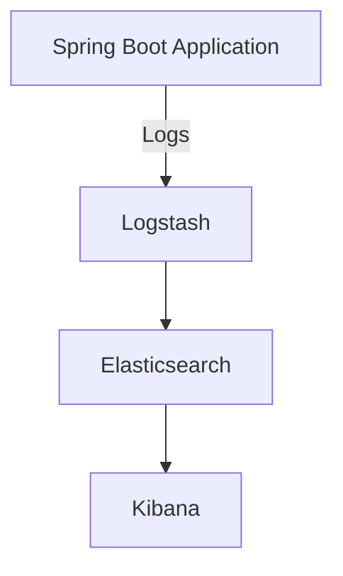

# Spring Boot Logging dengan ELK



Proyek ini adalah contoh implementasi logging sentral menggunakan ELK (Elasticsearch, Logstash, Kibana) dalam aplikasi Spring Boot.

## Deskripsi

Proyek ini menyediakan contoh implementasi logging sentral menggunakan ELK Stack dalam aplikasi Spring Boot. ELK Stack terdiri dari Elasticsearch untuk menyimpan dan mengindeks log, Logstash untuk memproses dan mengirim log ke Elasticsearch, dan Kibana untuk visualisasi dan analisis log.

## Fitur

- Pengaturan logging sentral menggunakan Logback dan Logstash
- Pengiriman log dari aplikasi Spring Boot ke Logstash
- Visualisasi dan analisis log menggunakan Kibana

# Requirements

- [Docker 20.05 or higher](https://docs.docker.com/install/)
- [Docker-Compose 1.29 or higher](https://docs.docker.com/compose/install/)
- 4GB RAM (For Windows and MacOS make sure Docker's VM has more than 4GB+ memory.)

## Cara Penggunaan

Berikut langkah-langkah untuk menjalankan proyek ini:

1. Pastikan Anda telah menginstal Docker dan Docker Compose.
2. Clone repository ini ke komputer Anda. ```
   git clone https://github.com/afrihar/elk-sb-logging.git```
3. Buka terminal dan navigasikan ke direktori proyek. `cd elk-sb-logging`
4. Jalankan perintah `make setup` untuk setup certificate dan keystore.
5. Jalankan perintah `make elk` untuk memulai semua layanan ELK dan aplikasi Spring Boot.
6. Jalankan perintah `make down` untuk menghentikan semua layanan ELK dan aplikasi Spring Boot.
5. Buka Kibana di browser dengan membuka alamat `https://localhost:5601`.
6. Navigasikan ke tab Discover di Kibana untuk melihat log yang telah diindeks.
7. Simulasi request#1
```curl http://localhost:8080/endpoint1```
8. Simulasi request#2
```curl http://localhost:8080/endpoint2```
9. Simulasi request#3
```curl --location 'localhost:8080/endpoint3' --header 'Content-Type: application/json' --data '{"test":"ok"}'```

## Kontribusi

Jika Anda ingin berkontribusi pada proyek ini, silakan ikuti langkah-langkah berikut:

1. Fork proyek.
2. Buat branch fitur baru (`git checkout -b fitur/DeskripsiFitur`).
3. Commit perubahan Anda (`git commit -am 'Tambahkan fitur baru'`).
4. Push ke branch (`git push origin fitur/DeskripsiFitur`).
5. Buat Pull Request baru.

## Lisensi

Proyek ini dilisensikan di bawah [LICENSE] MIT  - lihat file [LICENSE](LICENSE) untuk detail lebih lanjut.

